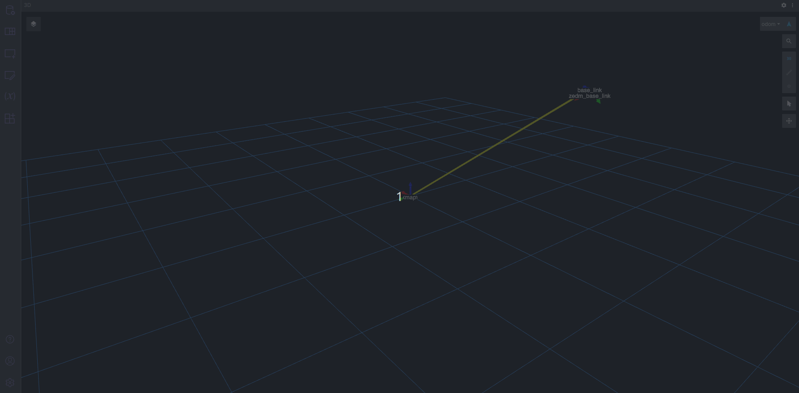

# BloX Zed Mini

The BloX Zed Mini interfaces with the [ZED Mini](https://www.stereolabs.com/zed-mini/) using the [ZED ROS2 Wrapper](https://github.com/stereolabs/zed-ros2-wrapper).

## Data

The BloX Zed Mini publishes various odometry and localization data based on visual-inertial measurements.

## Visualization

